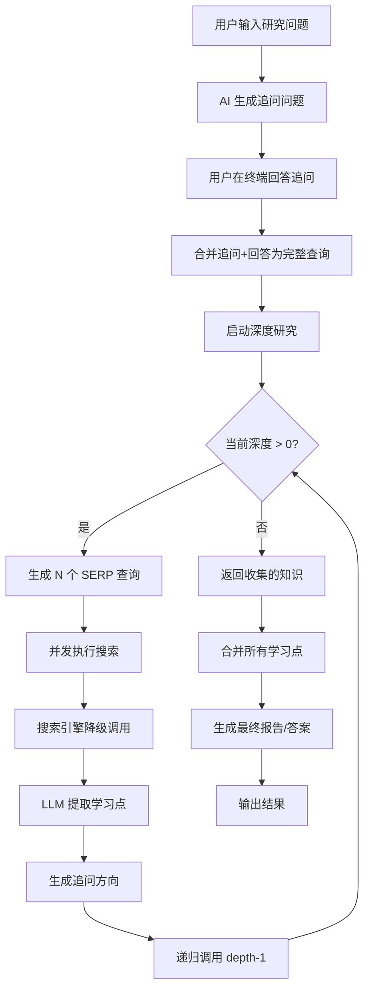
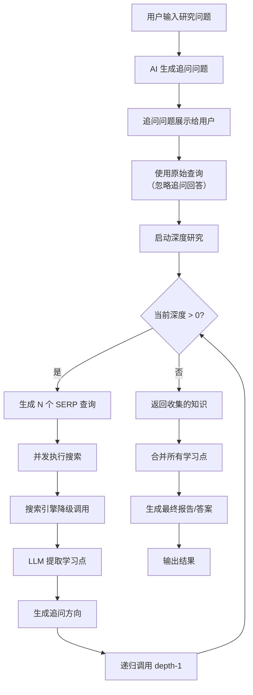
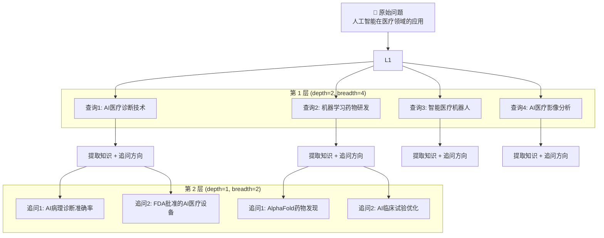
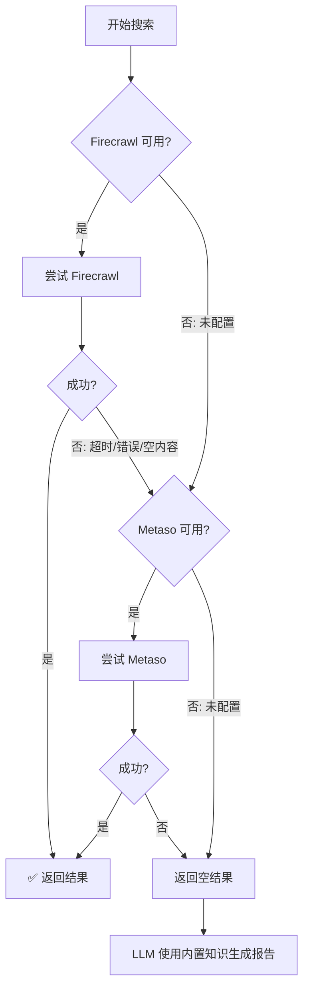
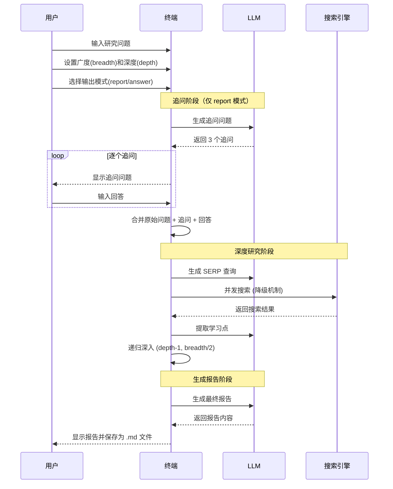
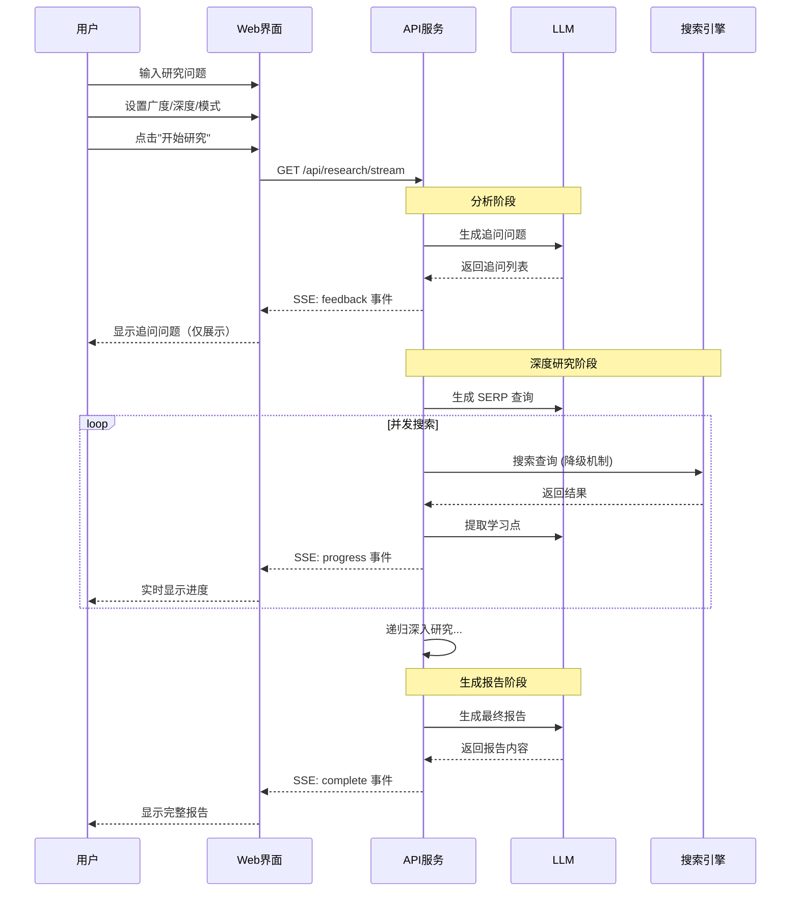
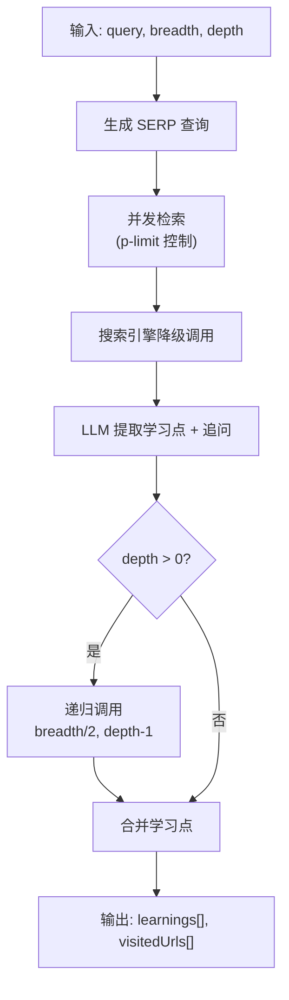
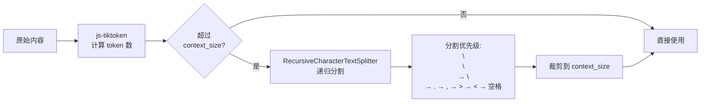
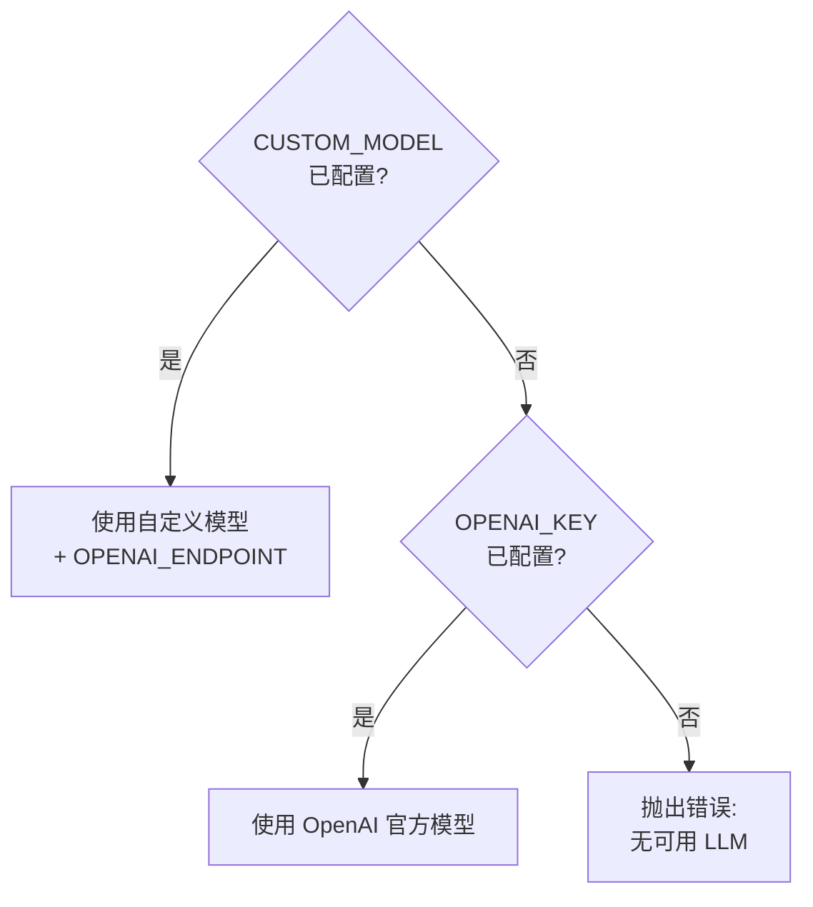
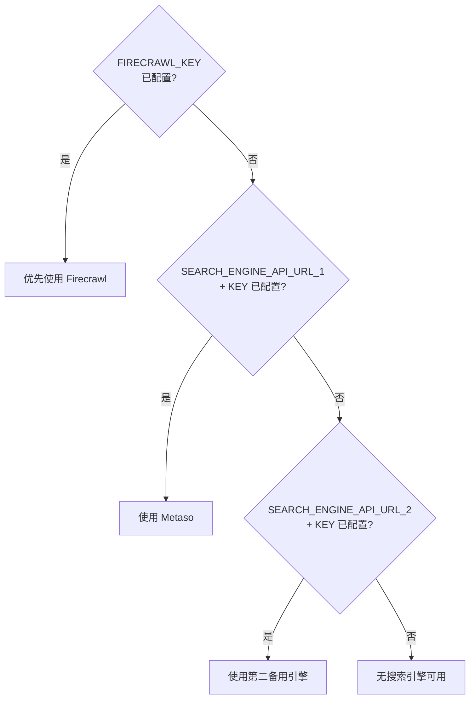

# 🔍 Deep Researcher

[](LICENSE)
[](.nvmrc)
[](tsconfig.json)

AI 驱动的深度研究助手，支持递归多步推理与网页检索，自动生成结构化研究报告。

---

## ✨ 功能特性

| 功能 | 说明 |
|------|------|
| 🔄 **递归深度研究** | 基于广度-深度算法，逐层拆解问题、检索网页、提取知识 |
| 🔌 **搜索引擎降级** | Firecrawl → Metaso → LLM 内置知识，多级容错机制 |
| 🤖 **多模型支持** | 支持 OpenAI 兼容接口的各类大模型（GPT、DeepSeek、Claude 等） |
| 📡 **SSE 实时推送** | 研究过程实时推送到 Web 界面（查询拆解、检索 URL、进度） |
| 🎨 **Tesla 风格 UI** | 暗色主题、左右分栏布局、Markdown 渲染、响应式设计 |
| 💻 **CLI 交互模式** | 终端内逐问答式深度研究 |
| 🔌 **REST API** | 可集成到其他系统的 HTTP 接口 |
| ⚡ **并发控制** | p-limit 限制并发调用数，防止 API 过载 |
| 🛡️ **上下文保护** | tiktoken token 计数 + 递归文本分割裁剪超长内容 |
| 📄 **报告导出** | 支持一键复制和导出为 Markdown 文件 |

---

## 效果图


---

## 📊 业务流程概览

本项目支持两种运行模式，**追问机制**在两种模式下有显著差异：

### 模式对比

| 特性 | CLI 交互模式 | Web 界面模式 |
|------|-------------|-------------|
| 追问生成 | ✅ 有 | ✅ 有 |
| 用户回答追问 | ✅ 终端输入 | ❌ 仅展示 |
| 回答用于研究 | ✅ 合并到查询 | ❌ 使用原始查询 |
| 交互方式 | 命令行问答 | SSE 实时推送 |

---

### CLI 模式流程（支持追问回答）



---

### Web 模式流程（追问仅展示）



---

## 🔄 深度与广度详解

### 概念定义

| 参数 | 定义 | 默认值 | 作用 |
|------|------|--------|------|
| **广度 (Breadth)** | 每层生成的搜索查询数量 | 4 | 决定研究的覆盖面，越大越广 |
| **深度 (Depth)** | 递归研究的层数 | 2 | 决定研究的深入程度，越大越深 |

### 递归逻辑示例

假设用户输入：`"人工智能在医疗领域的应用"`，设置 `breadth=4, depth=2`



### 递归参数变化

| 层级 | Depth | Breadth | 说明 |
|------|-------|---------|------|
| 第 1 层 | 2 | 4 | 初始搜索，广覆盖 |
| 第 2 层 | 1 | 2 | 基于追问深入，breadth 减半 |
| 第 3 层 | 0 | 1 | 最深层，仅处理学习点，不再递归 |

**核心逻辑：**
- 广度每层减半：`newBreadth = Math.ceil(breadth / 2)`
- 深度每层递减：`newDepth = depth - 1`
- 先宽后深：每层提取知识后，生成更具体的追问进行深入研究

---

## 🔌 搜索引擎降级机制

### 降级策略



### 触发降级的条件

| 条件 | 说明 |
|------|------|
| HTTP 错误 | API 返回 4xx/5xx 状态码 |
| 请求超时 | 超过设定的 timeout 时间 |
| 空内容 | Firecrawl 返回结果但 markdown 为空 |
| 配置缺失 | 对应引擎的 API Key 未配置 |

### 支持的搜索引擎

| 引擎 | 类型 | 内容深度 | 推荐场景 |
|------|------|----------|----------|
| **Firecrawl** | 主搜索引擎 | 完整页面 (markdown) | 深度研究，内容详尽 |
| **Metaso** | 备用搜索引擎 | 摘要片段 (snippet) | 快速信息检索，降级容错 |
| **LLM 内置知识** | 兜底方案 | 模型训练数据 | 所有引擎失败时的应急方案 |

---

## 🚀 快速开始

### 环境要求

- **Node.js** >= 22（推荐使用 nvm 管理版本）
- **Firecrawl API Key**（用于网页搜索与抓取）
- **大模型 API Key**（用于 LLM 推理）
- **Metaso API Key**（可选，备用搜索引擎）

### 1. 克隆项目

```bash
git clone https://github.com/your-username/deep-researcher.git
cd deep-researcher
```

### 2. 安装依赖

```bash
npm install
```

### 3. 配置环境变量

```bash
cp .env.example .env.local
```

编辑 `.env.local`，填入你的 API Key：

```env
# ========== 必需配置 ==========

# Firecrawl API 密钥（用于网页搜索）
# 获取方式：访问 https://firecrawl.dev/ 注册账号，在 Dashboard 的 API Keys 页面获取
FIRECRAWL_KEY=fc-xxxx

# 大模型 API Key
OPENAI_KEY=sk-xxxx

# ========== 大模型配置 ==========

# 大模型 API 地址（OpenAI 兼容接口）
# 如果使用 OpenAI 官方：可留空，默认为 https://api.openai.com/v1
# 如果使用第三方代理或私有部署：填写对应地址
OPENAI_ENDPOINT=https://api.openai.com/v1

# 自定义模型名称
# 如果使用 OpenAI：可填写 gpt-4o、gpt-4o-mini、o3-mini 等
# 如果使用其他兼容模型：填写对应的模型名称
CUSTOM_MODEL=gpt-4o

# ========== 可选配置 ==========

# Firecrawl 自托管地址（如果自部署 Firecrawl）
FIRECRAWL_BASE_URL=

# Firecrawl 并发限制（默认 2）
FIRECRAWL_CONCURRENCY=2

# LLM 上下文窗口大小（默认 128000）
CONTEXT_SIZE=128000

# API 服务端口（默认 3051）
PORT=3051

# ========== 备用搜索引擎配置（可选） ==========
# 当 Firecrawl 搜索失败或返回空结果时，自动降级使用备用搜索引擎

# 备用搜索引擎 1（如 Metaso）
# 获取方式：访问 https://metaso.cn/ 注册账号获取 API Key
SEARCH_ENGINE_API_URL_1=https://metaso.cn/api/v1/search
SEARCH_ENGINE_API_KEY_1=your_metaso_api_key

# 备用搜索引擎 2（可扩展，如 SerpAPI、Bing 等）
# SEARCH_ENGINE_API_URL_2=https://serpapi.com/search.json
# SEARCH_ENGINE_API_KEY_2=your_serpapi_key
```

### 4. 启动服务

**Web 界面模式**（推荐）：

```bash
npm run api:start
```

访问 [http://localhost:3051](http://localhost:3051)，在输入框输入研究问题，点击「开始研究」即可。

**CLI 交互模式**：

```bash
npm start
```

终端中逐问答式进行深度研究，结果保存为 `report.md` 或 `answer.md`。

---

## 📖 使用指南

本项目支持两种运行模式，适用于不同的使用场景。

---

### CLI 交互模式

**特点：** 支持追问回答，研究结果更精准



**启动命令：**

```bash
npm start
```

**交互流程：**

1. 输入研究问题
2. 设置广度（默认 4）和深度（默认 2）
3. 选择输出模式（report 或 answer）
4. 回答 AI 生成的追问问题（仅 report 模式）
5. 等待研究完成，结果保存为 `report.md` 或 `answer.md`

---

### Web 界面模式

**特点：** 实时可视化研究过程，追问仅展示不收集回答



**启动命令：**

```bash
npm run api:start
```

**访问地址：** http://localhost:3051

**界面说明：**

| 区域 | 说明 |
|------|------|
| 左侧 4/5 | 研究结果展示区（Markdown 渲染）+ 聊天输入框 |
| 右侧 1/5 | 实时流式展示研究过程：查询分解、检索 URL、深度/广度进度条 |

**参数说明：**

| 参数 | 说明 | 默认值 | 建议范围 |
|------|------|--------|----------|
| **广度** | 每层搜索查询数量，越大覆盖面越广 | 4 | 2-6 |
| **深度** | 递归研究层数，越大越深入 | 2 | 1-4 |
| **模式** | `研究报告` 生成详细报告，`简短回答` 生成精简答案 | 报告 | - |

**报告操作：**

- 鼠标悬停在报告区域，右上角显示操作按钮
- 📋 **复制**：一键复制报告全文到剪贴板
- 💾 **导出**：下载 Markdown 格式的报告文件

### REST API

#### `POST /api/research` - 精简答案

```bash
curl -X POST http://localhost:3051/api/research \
  -H "Content-Type: application/json" \
  -d '{"query": "量子计算最新进展", "depth": 3, "breadth": 3}'
```

**响应：**

```json
{
  "success": true,
  "answer": "简短答案...",
  "learnings": ["学习点1", "学习点2"],
  "visitedUrls": ["https://..."]
}
```

#### `POST /api/generate-report` - 生成报告

```bash
curl -X POST http://localhost:3051/api/generate-report \
  -H "Content-Type: application/json" \
  -d '{"query": "量子计算最新进展", "depth": 3, "breadth": 3}'
```

**响应：**

```json
{
  "success": true,
  "report": "# 量子计算最新进展\n\n..."
}
```

#### `GET /api/research/stream` - SSE 流式端点

```bash
curl "http://localhost:3051/api/research/stream?query=量子计算&depth=3&breadth=3&mode=report"
```

**SSE 事件类型：**

| 事件 | 数据格式 | 说明 |
|------|----------|------|
| `status` | `{ phase, message }` | 当前阶段状态 |
| `feedback` | `{ questions: string[] }` | 生成的追问问题 |
| `progress` | `{ currentDepth, totalDepth, currentBreadth, totalBreadth, currentQuery, totalQueries, completedQueries, searchEngine }` | 研究进度 |
| `complete` | `{ output, learnings, visitedUrls, mode }` | 最终结果 |
| `error` | `{ message }` | 错误信息 |

---

## 🏗️ 项目结构

```
deep-researcher/
├── .env.example              # 环境变量模板
├── .env.local                # 本地环境变量（不提交）
├── .nvmrc                    # Node.js 版本
├── .gitignore
├── Dockerfile                # 容器配置
├── docker-compose.yml        # Docker 编排
├── ecosystem.config.cjs      # PM2 进程管理配置
├── package.json              # 项目配置与依赖
├── tsconfig.json             # TypeScript 配置
├── prettier.config.mjs       # 代码格式化配置
├── SEARCH_FALLBACK.md        # 搜索降级机制详细文档
└── src/
    ├── ai/
    │   ├── providers.ts      # LLM 提供商选择 + 兼容封装
    │   └── text-splitter.ts  # 递归字符文本分割器
    ├── prompt.ts             # 系统提示词定义
    │   feedback.ts           # 追问问题生成器
    ├── search-engines.ts     # 搜索引擎适配器 + 降级逻辑
    ├── deep-research.ts      # 核心递归研究引擎
    ├── run.ts                # CLI 入口
    ├── api.ts                # Express API + SSE + 静态文件服务
    └── web/
        └── index.html        # Web 界面
```

---

## ⚙️ 核心算法

### 递归广度-深度研究算法



### 算法伪代码

```typescript
async function deepResearch(query, breadth, depth, learnings) {
  // 1. 生成搜索查询
  const queries = await generateSerpQueries(query, breadth, learnings);

  // 2. 并发执行搜索
  const results = await Promise.all(
    queries.map(q => limit(async () => {
      // 3. 搜索引擎降级调用
      const { result, engine } = await searchWithFallback(q.query);

      // 4. 提取学习点
      const { learnings, followUpQuestions } = await processSerpResult(result);

      // 5. 递归深入
      if (depth > 0) {
        const subResult = await deepResearch(
          followUpQuestions,
          Math.ceil(breadth / 2),  // 广度减半
          depth - 1,               // 深度递减
          [...learnings, ...newLearnings]
        );
        return merge(learnings, subResult.learnings);
      }

      return { learnings, visitedUrls };
    }))
  );

  // 6. 去重合并
  return deduplicate(results);
}
```

### 上下文窗口保护



---

## 🔧 配置参数详解

### 环境变量说明

| 参数名 | 必需 | 默认值 | 说明 |
|--------|------|--------|------|
| `FIRECRAWL_KEY` | ✅ | - | Firecrawl API 密钥 |
| `OPENAI_KEY` | ✅ | - | 大模型 API Key |
| `OPENAI_ENDPOINT` | ❌ | `https://api.openai.com/v1` | OpenAI 兼容接口地址 |
| `CUSTOM_MODEL` | ❌ | - | 自定义模型名称 |
| `FIRECRAWL_BASE_URL` | ❌ | - | Firecrawl 自托管地址 |
| `FIRECRAWL_CONCURRENCY` | ❌ | `2` | 并发限制数 |
| `CONTEXT_SIZE` | ❌ | `128000` | LLM 上下文窗口大小 |
| `PORT` | ❌ | `3051` | API 服务端口 |
| `SEARCH_ENGINE_API_URL_1` | ❌ | - | 备用搜索引擎 API 地址 |
| `SEARCH_ENGINE_API_KEY_1` | ❌ | - | 备用搜索引擎 API Key |
| `SEARCH_ENGINE_API_URL_2` | ❌ | - | 第二备用搜索引擎 API 地址 |
| `SEARCH_ENGINE_API_KEY_2` | ❌ | - | 第二备用搜索引擎 API Key |

### 模型优先级

系统按以下优先级选择模型：



### 搜索引擎优先级



---

## 📦 npm Scripts

### 基础命令

| 命令 | 说明 |
|------|------|
| `npm start` | 启动 CLI 交互模式 |
| `npm run api` | 前台启动 Web + API 服务 |
| `npm run docker` | Docker 容器内运行 |
| `npm run format` | Prettier 格式化代码 |

### PM2 进程管理（推荐）

| 命令 | 说明 |
|------|------|
| `npm run api:start` | 后台启动服务（守护进程） |
| `npm run api:stop` | 停止服务 |
| `npm run api:restart` | 重启服务 |
| `npm run api:status` | 查看服务状态 |
| `npm run api:logs` | 查看服务日志 |

---

## 🐳 Docker 部署

```bash
# 构建并启动
docker compose up --build

# 后台运行
docker compose up -d

# 查看日志
docker compose logs -f

# 停止服务
docker compose down
```

确保已创建 `.env.local` 文件并填入 API Key。

---

## 🔧 支持的模型

本项目支持任何兼容 OpenAI API 格式的大模型服务：

| 服务 | 示例模型 | 说明 |
|------|----------|------|
| **OpenAI** | GPT-4o, GPT-4o-mini, o3-mini | 官方 API |
| **DeepSeek** | DeepSeek-V3, DeepSeek-R1 | 国产大模型 |
| **Claude** | claude-3-opus, claude-3-sonnet | 通过 OpenAI 兼容代理访问 |
| **本地模型** | Ollama, vLLM | 自部署服务 |
| **第三方代理** | 各类 API 中转服务 | 使用 OPENAI_ENDPOINT 配置 |

---

## 🤝 贡献指南

欢迎贡献代码、报告问题或提出建议！

1. Fork 本项目
2. 创建特性分支 (`git checkout -b feature/amazing-feature`)
3. 提交更改 (`git commit -m 'Add amazing feature'`)
4. 推送到分支 (`git push origin feature/amazing-feature`)
5. 创建 Pull Request

### 扩展搜索引擎

要添加新的备用搜索引擎，参考 `SEARCH_FALLBACK.md` 文档。

---

## 📄 License

本项目采用 [MIT License](LICENSE) 开源协议。

---

## 🙏 致谢

- [Firecrawl](https://firecrawl.dev/) - 网页搜索与抓取服务
- [Metaso](https://metaso.cn/) - 备用搜索引擎
- [Vercel AI SDK](https://sdk.vercel.ai/) - AI SDK 工具库
- [Express](https://expressjs.com/) - Web 框架
- [tsx](https://github.com/privatenumber/tsx) - TypeScript 执行器

---

## 📧 联系方式

如有问题或建议，请通过以下方式联系：

- 提交 [GitHub Issue](https://github.com/your-username/deep-researcher/issues)
- 发送邮件至：your-email@example.com

---

<p align="center">如果这个项目对你有帮助，请给个 ⭐ Star 支持一下！</p>
